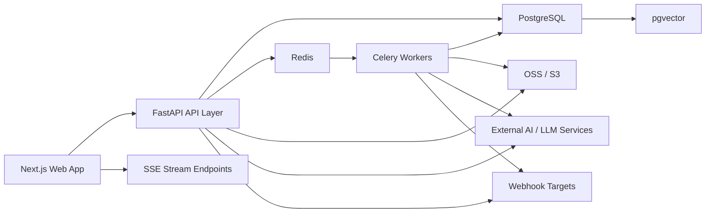

# 赛博投研正式技术架构选型文档

## 1. 文档信息

- 文档名称：赛博投研正式技术架构选型文档
- 文档版本：V1.0
- 更新时间：2026-04-17
- 适用范围：产品、前端、后端、AI工程、测试、运维
- 关联文档：
  - [总 PRD](/Users/lushuailei/PycharmProjects/ai/docs/prd/00-赛博投研总PRD.md)
  - [PRD 索引](/Users/lushuailei/PycharmProjects/ai/docs/prd/README.md)
  - [产品体验审计](/Users/lushuailei/PycharmProjects/ai/docs/audit/产品体验审计.md)

## 2. 架构目标

本技术架构面向赛博投研当前产品需求，重点满足以下目标：

- 支撑内容工作台、研究员配置台、资讯聚合页等高信息密度前端页面
- 支撑 AI 文档生成、资讯解读、音频转写、推荐追问等 AI 场景
- 支撑任务编排、自驱任务、Webhook 分发、模拟交易日志等异步场景
- 支撑社区、文件夹、知识库、技能、MCP 等平台化能力
- 在第一阶段优先满足“快速上线 + 可维护 + 可演进”，避免过早引入过重基础设施

## 3. 总体技术选型结论

### 3.1 前端

- 框架：`Next.js 14+`
- 运行时：`React 18+`
- 语言：`TypeScript`
- 路由模式：`App Router`
- 状态管理：`Zustand`
- 服务端状态管理：`TanStack Query`
- 表单方案：`React Hook Form + Zod`
- UI 组件：`Ant Design`
- 样式方案：`Tailwind CSS`
- 图表：`echarts-for-react`
- 富文本/Markdown：`react-markdown` + `remark-gfm`，必要时配 `Tiptap`
- 实时通信：浏览器原生 `EventSource` + SSE

### 3.2 后端

- 框架：`FastAPI`
- 语言：`Python 3.11+`
- 数据模型：`Pydantic v2`
- ORM：`SQLAlchemy 2.0`
- 数据迁移：`Alembic`
- 主数据库：`PostgreSQL 15+`
- 缓存：`Redis`
- 异步任务：`Celery`
- 定时调度：`Celery Beat`
- 实时输出：`SSE`
- 文件存储：`阿里云 OSS` 或兼容 `S3` 存储
- 向量检索：`pgvector`

### 3.3 核心原则

- 所有前端模块默认按“页面层 / 业务组件层 / 基础组件层 / 数据访问层”分层
- 所有后端模块默认按“Router / Service / Repository / Domain / Task”分层
- 需要异步处理的能力优先通过 `Celery` 解耦，不把重任务放在请求链路中同步执行
- 优先采用 `SSE` 实现 AI 输出流、日志流、长任务状态回传，避免第一阶段引入复杂 WebSocket 系统
- 优先使用 `PostgreSQL + Redis`，只在确实必要时再引入额外中间件

## 4. 选型理由

### 4.1 为什么前端选 Next.js + React

1. 平台同时存在官网、工作台、公开内容页、分享页、社区详情页等多种页面类型，`Next.js` 适合统一承载。
2. `React` 在复杂工作台、配置表单、富交互、内容渲染和 AI 页面上生态成熟。
3. `App Router` 适合做页面级布局复用，例如工作台侧边导航、顶部导航和多级内容区。
4. `TanStack Query` 适合高频读写、分页列表、缓存刷新、SSE 后局部失效更新。
5. `React Hook Form + Zod` 适合研究员编辑器、自驱任务、Webhook 配置等复杂表单。
6. `Ant Design` 适合管理后台、工作台、配置页、数据表格和弹窗场景。

### 4.2 为什么后端选 FastAPI + Python

1. 产品中 AI 生成、文本分析、音频转写、向量检索、资讯归纳等能力与 Python 生态天然匹配。
2. `FastAPI` 同时适合标准业务接口与 AI 场景接口，开发效率高，文档自动生成能力强。
3. `Celery` 非常适合任务编排、自驱任务、Webhook 重试、文档生成、音频转写等异步任务。
4. `SQLAlchemy + Alembic` 可兼顾工程化、可维护性和较复杂业务模型。
5. 第一阶段用 `PostgreSQL + Redis` 已可覆盖主业务，无需过早引入更重的分布式系统。

## 5. 总体架构图



## 6. 前端架构规范

### 6.1 推荐目录结构

```txt
web/
  app/
    (marketing)/
    (auth)/
    (workstation)/
    api/
  components/
    ui/
    business/
    charts/
  features/
    researcher/
    documents/
    tasks/
    news/
    community/
    notes/
    webhook/
    billing/
  hooks/
  lib/
    request/
    auth/
    sse/
    constants/
    utils/
  stores/
  schemas/
  types/
  styles/
```

### 6.2 前端分层要求

- `app/`：页面入口、路由布局、服务端页面拼装
- `features/`：按业务模块组织逻辑
- `components/ui/`：通用基础组件
- `components/business/`：业务复合组件
- `stores/`：少量全局状态，如用户态、主题态、工作台上下文
- `lib/request/`：统一 HTTP 请求封装
- `lib/sse/`：统一 SSE 连接、重连、消息解析

### 6.3 前端状态管理原则

- 服务端状态统一使用 `TanStack Query`
- 本地 UI 状态与跨页面轻状态使用 `Zustand`
- 表单状态统一使用 `React Hook Form`
- 复杂表单校验统一使用 `Zod`

### 6.4 前端设计要求

- 工作台页面优先桌面体验，同时保证移动端可访问
- 页面必须具备：加载态、空态、错误态、权限态
- 高频页面应支持骨架屏与局部刷新
- 列表页必须支持分页或无限滚动，不允许一次性全量加载重列表

## 7. 后端架构规范

### 7.1 推荐目录结构

```txt
server/
  app/
    api/
      v1/
    core/
      config.py
      security.py
      database.py
      redis.py
      logging.py
    models/
    schemas/
    repositories/
    services/
    tasks/
    streams/
    integrations/
      llm/
      oss/
      webhook/
      news/
      transcription/
    utils/
  alembic/
  tests/
  worker/
```

### 7.2 后端分层要求

- `api/`：仅做参数接收、响应组装和鉴权入口
- `services/`：业务编排层
- `repositories/`：数据库访问层
- `tasks/`：Celery 任务
- `integrations/`：外部系统接入层
- `streams/`：SSE 长连接输出与流式事件封装

### 7.3 后端原则

- 接口尽量保持幂等，尤其是任务创建、发布、Webhook 保存、会员订单回调等场景
- 请求链路内不做长时间 AI 处理，同步接口负责入队或返回流式连接信息
- 所有异步任务需要有状态表、执行日志和错误重试策略
- 所有敏感配置需加密存储，例如 Webhook Secret、上传 Token 等

## 8. 基础设施选型

### 8.1 PostgreSQL

用途：

- 用户、研究员、文档、社区、笔记、会员、电池等主业务数据存储
- 全文检索初期可使用 PostgreSQL FTS
- 向量检索使用 `pgvector`

推荐扩展：

- `pgvector`
- `pg_trgm`
- `uuid-ossp` 或 `pgcrypto`

### 8.2 Redis

用途：

- Celery Broker / Result Backend
- 热点榜单缓存
- AI 解读缓存
- 登录态辅助缓存
- SSE 事件协调与频控

### 8.3 OSS / S3

用途：

- 音频文件
- 用户上传图片
- 研究员头像
- 社区图片
- 导出文档或中间产物

### 8.4 Celery + Celery Beat

用途：

- 自驱任务调度
- 资讯聚合
- 文档生成
- 音频转写
- Webhook 分发与重试
- 推荐问题生成

## 9. 通信方式规范

### 9.1 HTTP API

适用于：

- 查询列表与详情
- 普通创建/更新/删除
- 配置保存
- 鉴权与账户类接口

### 9.2 SSE

适用于：

- AI 研究员流式回复
- 研究员测试对话
- 模拟交易日志流
- 长任务执行进度

### 9.3 异步任务

适用于：

- 文档生成
- 音频转写
- 资讯分析聚合
- 社区热点计算
- Webhook 推送
- 定时任务

## 10. 鉴权与安全

### 10.1 鉴权机制

- Access Token：`JWT`
- Refresh Token：服务端可控刷新机制
- 前端通过统一请求层注入鉴权头
- 分享页与公开文档采用公开访问策略，但内部用户数据不可外泄

### 10.2 安全要求

- 所有写接口必须鉴权
- Secret、Token、签名等敏感字段需加密存储
- 上传接口必须校验文件类型与大小
- 高风险操作必须保留审计日志
- 社区、文档、模拟交易页面必须明确风险文案

## 11. 数据与搜索策略

### 11.1 搜索

第一阶段：

- 使用 PostgreSQL FTS + `pg_trgm`
- 支持研究员搜索、帖子搜索、文档搜索、技能/MCP 搜索

第二阶段：

- 如搜索规模和复杂度明显提升，再引入 Elasticsearch / OpenSearch

### 11.2 向量检索

- 知识库文档切片入库 `pgvector`
- 推荐追问、相似文档、知识检索优先用 `pgvector`
- 第一阶段不引入独立向量数据库

## 12. 模块级技术映射

| 模块 | 前端 | 后端 | 备注 |
| --- | --- | --- | --- |
| AI研究员工作台 | Next.js + Query + ECharts | FastAPI + PostgreSQL + Redis | 首页聚合接口建议缓存 |
| 人才市场/编辑器 | RHF + Zod + AntD | FastAPI + SQLAlchemy + Celery | 测试对话走 SSE |
| 文档中心 | Markdown 渲染 | FastAPI + PostgreSQL | 评论统计异步更新 |
| 任务编排 | 表单与任务列表 | FastAPI + Celery Beat | 核心异步模块 |
| 盘前速览 | ECharts + Card Grid | FastAPI 聚合 + Redis | 多源聚合缓存 |
| 资讯分析 | 双栏内容页 | FastAPI + Celery | AI 解读可异步缓存 |
| 模拟交易 | SSE + 图表 + 时间线 | FastAPI + PostgreSQL + SSE | 强风险提示 |
| 社区 | 内容流 + 评论 | FastAPI + PostgreSQL | 图片上传到 OSS |
| 文件夹/笔记 | 编辑器 + 树结构 | FastAPI + OSS + Celery | 转写异步处理 |
| Webhook | 配置表单 | FastAPI + Celery | 投递重试与审计 |
| 知识/技能/MCP | 市场页 + 选择器 | FastAPI + PostgreSQL + pgvector | 能力生态层 |
| 会员/电池/邀请 | 账户页 + 套餐页 | FastAPI + PostgreSQL | 事务一致性要求高 |

## 13. 非功能要求

### 13.1 性能

- 首屏可交互时间目标：3 秒内
- 热门列表接口响应目标：500ms 内
- AI 首 token 返回目标：3 秒内
- SSE 重连目标：5 秒内恢复

### 13.2 可用性

- 核心模块需支持模块级降级
- 外部依赖异常不应导致全站不可用
- 长任务必须有状态追踪与失败提示

### 13.3 可观测性

- API 请求日志
- Celery 任务日志
- 推送日志
- AI 调用日志
- 审计日志
- 关键指标埋点

## 14. 开发规范

### 14.1 前端规范

- 新页面默认采用 TypeScript 严格模式
- 不直接在页面组件中写复杂业务请求逻辑
- Query key 命名统一
- 表单 schema 与类型统一维护
- 组件优先复用，不复制大段 JSX 逻辑

### 14.2 后端规范

- Router 不写业务逻辑
- Service 不直接拼 SQL
- Repository 不承担业务规则
- Celery 任务必须记录状态与错误
- 所有模型变更必须通过 Alembic 迁移

## 15. 分阶段实施建议

### 阶段一：P0 闭环

- 登录注册
- AI研究员工作台
- 人才市场
- 文档详情
- 盘前速览
- 资讯分析
- 基础文件夹
- 电池/会员基础能力

### 阶段二：P1 增强

- 研究员编辑器
- 任务编排
- 社区
- 模拟交易
- Webhook
- 音频转写

### 阶段三：生态扩展

- 技能市场
- MCP 市场
- 知识库深化
- 回测复盘强化
- 因子洞察正式化

## 16. 明确不推荐的方案

- 前端首期不推荐微前端
- 后端首期不推荐拆成过多微服务
- 首期不推荐为了搜索单独上 Elasticsearch
- 首期不推荐为了实时功能优先引入 WebSocket 集群
- 首期不推荐引入过重的工作流引擎替代 Celery

## 17. 架构选型结论

赛博投研当前阶段的正式技术架构选型确认为：

- 前端：`Next.js 14+ + React 18+ + TypeScript + Zustand + TanStack Query + React Hook Form + Zod + Ant Design + Tailwind CSS + ECharts`
- 后端：`FastAPI + Python 3.11+ + Pydantic v2 + SQLAlchemy 2.0 + Alembic + PostgreSQL + Redis + Celery + Celery Beat + SSE`
- 存储与检索：`OSS/S3 + PostgreSQL FTS + pgvector`

该方案兼顾当前产品复杂度、AI 场景适配度、研发效率与未来演进空间，作为现阶段正式落地标准执行。
